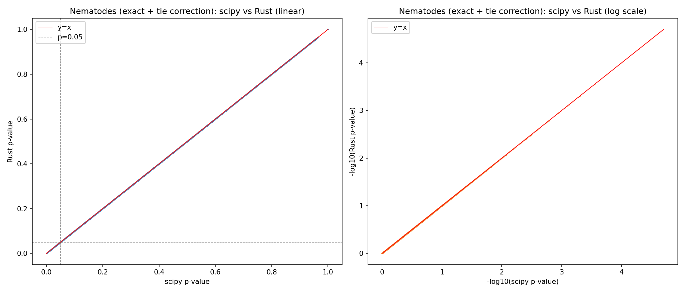
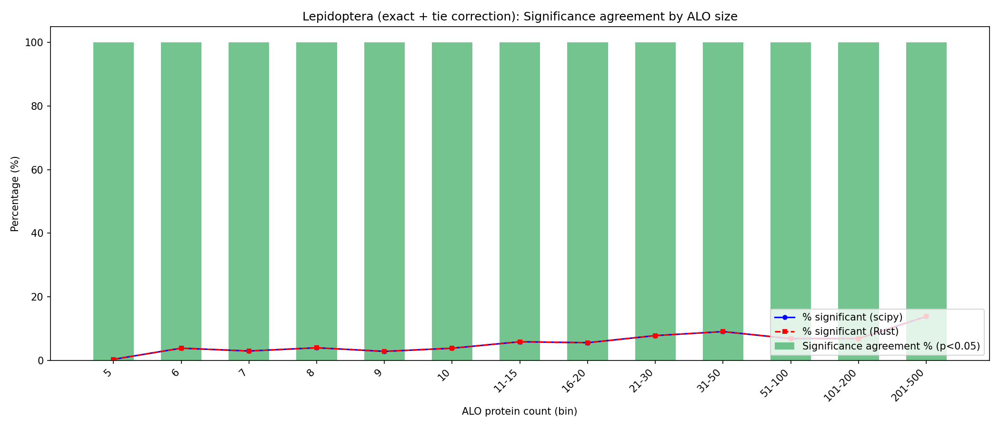
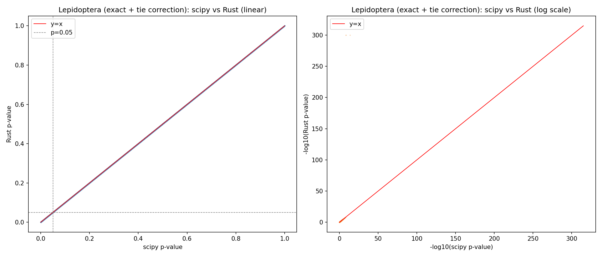

# Rust Statistics Refactoring — Benchmark Summary

## Context

KinFin's statistical bottleneck is the cluster analysis loop in `DataFactory.analyse_clusters()`.
For each cluster × attribute × level combination that meets the `--min_proteomes` threshold,
a Mann-Whitney U test (or t-test / KS / Kruskal-Wallis) is called via `scipy.stats`.
On datasets with hundreds of proteomes this loop runs tens of thousands of tests and dominates
overall runtime.

This directory documents a proof-of-concept implementation of the MWU test in Rust
(via [PyO3](https://pyo3.rs/)) and the resulting performance and accuracy trade-offs.

---

## Implementation

### `kinfin_stats` Rust extension (../kinfin_stats/)

A PyO3 extension module that exposes `mannwhitneyu`, `ttest_ind`, `ks_2samp`, and `kruskal`
to Python. The MWU implementation matches scipy's algorithm precisely:

- U statistic computed from rank sums with average-rank tie handling
- Exact combinatorial p-value when `min(n1, n2) ≤ 8` and no ties (DP over rank sequences)
- Asymptotic normal approximation with tie-corrected variance for larger samples
- Normal CDF via `statrs::distribution::Normal::cdf()` (matches scipy `ndtr` to floating-point precision)

Enabled at runtime via the environment variable:

```sh
export KINFIN_USE_RUST=1   # switches statistic() in src/core/utils.py to Rust path
```

The fallback to scipy is automatic if `kinfin_stats` is not importable.

### Benchmark methodology

Rather than timing the full pipeline (which includes I/O, image generation, etc.) two isolated
scripts bracket the cluster analysis loop specifically:

1. **`prepare_cluster_data.py`** — runs the pipeline up to `analyse_clusters()` and serialises
   all ALO collections + cluster data to JSON.
2. **`run_cluster_analysis.py`** (Python) — loads the JSON and runs the same test loop as
   `datastore.py`, recording only the analysis time.
3. **`../kinfin_stats/src/bin/run_cluster_analysis.rs`** — Rust binary with identical logic,
   reads the same JSON, outputs identical TSV.

The Python and Rust TSVs are sorted and compared with **`analyse_pvalue_diffs.py`**.

---

## Performance Results

### Isolated cluster analysis loop

| Dataset                           | Clusters | Proteomes | Stat tests | Python | Rust   | Speedup  |
| --------------------------------- | -------- | --------- | ---------- | ------ | ------ | -------- |
| Nematodes (`config.advanced.txt`) | 42,691   | 19        | 48,426     | 9.8 s  | 1.3 s  | **7.7×** |
| Lepidoptera (`config.json`)       | 45,150   | 277       | 103,254    | 114 s  | 17.8 s | **6.4×** |

Benchmarks run on an Apple M-series MacBook (single core, `--release` Rust build).
The Rust implementation currently uses `statrs` for the normal CDF (matches scipy `ndtr` to
floating-point precision); see the accuracy section below.

### Batch-mode experiment (rejected)

A two-pass variant was also tested: Python collects all test pairs in pass 1, then makes a
single FFI call to a `batch_mannwhitneyu` Rust function in pass 2. Despite the lower FFI
overhead per test, the extra Python-side bookkeeping added ~45% overhead compared to
per-test calls (12.9 s vs 8.9 s on nematodes). **Batch mode is not recommended.**

---

## Accuracy Analysis

### Summary

| Implementation                          | Nematodes flips | Lepidoptera flips | Sig agreement                 |
| --------------------------------------- | --------------- | ----------------- | ----------------------------- |
| A-S approx (original)                   | 2.29%           | 4.73%             | 97.7% / 95.3%                 |
| statrs CDF only                         | 2.29%           | 4.73%             | 97.7% / 95.3% — **no change** |
| statrs + exact small-n + tie correction | **0%**          | **0%**            | **100% / 100%**               |

The root causes of the significance flips were **not** the CDF polynomial quality:

1. **Exact vs normal approximation (main cause):** scipy switches to exact combinatorial
   computation when either sample has ≤ 8 elements and there are no ties. The Rust code
   previously always used the normal approximation.
2. **Tie correction missing (secondary cause):** when samples have tied values, scipy
   applies a tie correction to the variance (`(t³-t)` reduction per tied run). The Rust
   asymptotic path was using the uncorrected variance.

Both issues are now fixed. The statrs CDF replacement did improve numerical precision
(max difference 1.4×10⁻⁷ vs 10⁻⁸) but was not the source of significance disagreements.

### Speed after all changes

| Dataset     | Python | Rust v1 (A-S) | Rust v4 (statrs+exact) | Speedup  |
| ----------- | ------ | ------------- | ---------------------- | -------- |
| Nematodes   | 9.8 s  | 1.3 s         | 1.3 s                  | **7.5×** |
| Lepidoptera | 114 s  | 17.8 s        | 16.3 s                 | **7.0×** |

Speed is unchanged — the additional exact DP and tie-correction are negligible vs the
rank-sort computation that dominates each test.

---

## Achieving scipy-equivalent accuracy

Three changes were required to reach 100% significance agreement with scipy:

### 1 — `statrs` CDF (numerical precision)

The original implementation used the Abramowitz & Stegun polynomial for `erf()` (max
absolute error ~1.5×10⁻⁷). This was replaced with `statrs::distribution::Normal::cdf()`
which matches scipy's `ndtr` to floating-point precision.

This improved numerical precision (33,347 of 48,426 nematode p-values changed by up to
1.4×10⁻⁷) but did **not** change any significance calls — the A-S error was never large
enough to flip a result at p = 0.05.

### 2 — Exact method for small n

scipy switches to exact combinatorial computation when `min(n1, n2) ≤ 8` and there are no
ties. The Rust code previously always used the normal approximation, causing systematic
disagreement on small ALOs.

The exact p-value is computed via the DP recurrence:

```
f(k, i, j) = f(k, i−1, j) + f(k−i, i, j−1)
```

where `f(k, i, j)` counts interleavings of `i` X's and `j` Y's giving U = k.
Time O(m²n), space O(mn), where m = min(n1, n2) ≤ 8 — negligible overhead.

### 3 — Tie-corrected variance

When samples contain tied values, scipy applies the correction

$$\sigma^2_U = \frac{n_1 n_2}{12} \left[ (n+1) - \frac{\sum_k (t_k^3 - t_k)}{n(n-1)} \right]$$

where $t_k$ is the size of the $k$-th tied run. The Rust asymptotic path was using the
uncorrected $\sigma^2_U = n_1 n_2 (n+1) / 12$. Since protein counts are integers, ties are
common and this was the dominant source of significance disagreements.

### Final accuracy: Nematodes

100% significance agreement — 0 flips across 48,426 MWU tests.




### Final accuracy: Lepidoptera

100% significance agreement — 0 flips across 103,254 MWU tests.




---

## Files in this directory

| File                      | Purpose                                                        |
| ------------------------- | -------------------------------------------------------------- |
| `README.md`               | This document                                                  |
| `prepare_cluster_data.py` | Serialise pipeline state to JSON before the analysis loop      |
| `run_cluster_analysis.py` | Pure-Python isolated benchmark (mirrors `datastore.py` logic)  |
| `analyse_pvalue_diffs.py` | Compare Python vs Rust TSV outputs; generate charts and tables |
| `plots/`                  | All benchmark charts and bin-stats TSV tables                  |

The Rust benchmark binary source is at `../kinfin_stats/src/bin/run_cluster_analysis.rs`.
Build with:

```sh
cd ../kinfin_stats && cargo build --release --bin run_cluster_analysis
```

### Reproducing the benchmark

```sh
# 1. Prepare data (example: nematodes)
conda run -n kinfin python refactoring/prepare_cluster_data.py \
  -g ~/tmp/kinfin/nematodes/kinfin.OrthoFinder.txt \
  -c ~/tmp/kinfin/nematodes/kinfin.config.advanced.txt \
  -s ~/tmp/kinfin/nematodes/kinfin.SequenceIDs.txt \
  -o /tmp/nem_cluster_data.json

# 2a. Python benchmark
conda run -n kinfin python refactoring/run_cluster_analysis.py \
  /tmp/nem_cluster_data.json --output /tmp/nem_py.tsv

# 2b. Rust benchmark
./kinfin_stats/target/release/run_cluster_analysis \
  /tmp/nem_cluster_data.json --output /tmp/nem_rust.tsv

# 3. Sort and compare
(head -1 /tmp/nem_py.tsv; tail -n +2 /tmp/nem_py.tsv | sort -k1,1 -k2,2 -k3,3) > /tmp/nem_py_s.tsv
(head -1 /tmp/nem_rust.tsv; tail -n +2 /tmp/nem_rust.tsv | sort -k1,1 -k2,2 -k3,3) > /tmp/nem_rust_s.tsv
conda run -n kinfin python refactoring/analyse_pvalue_diffs.py \
  --py /tmp/nem_py_s.tsv --rust /tmp/nem_rust_s.tsv \
  --outdir refactoring/plots --prefix nem --title "Nematodes"
```
