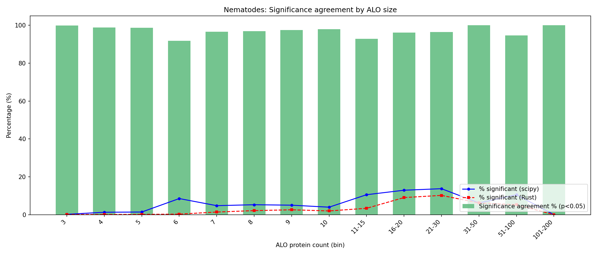
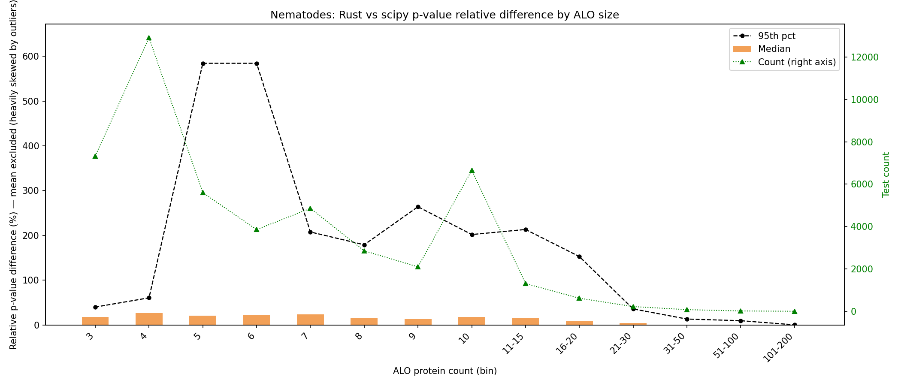
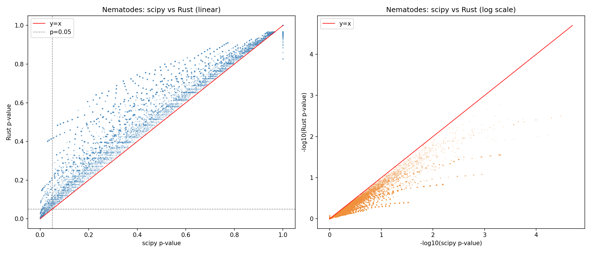
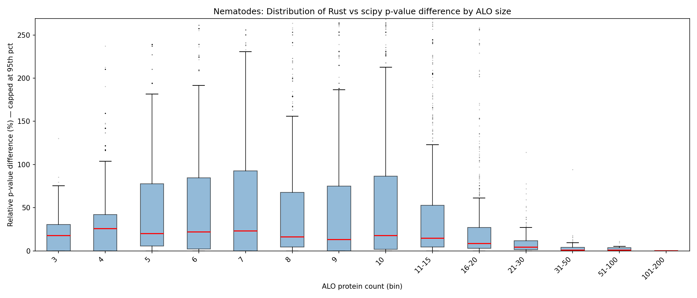
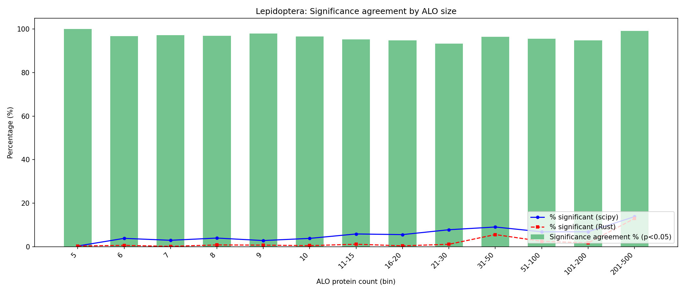
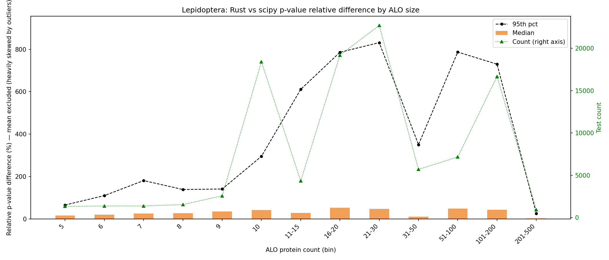
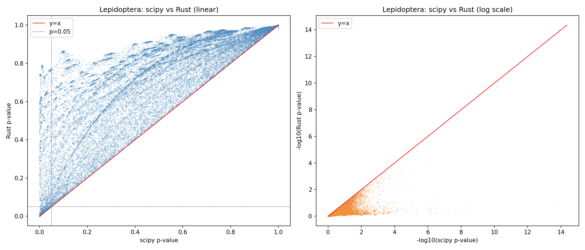
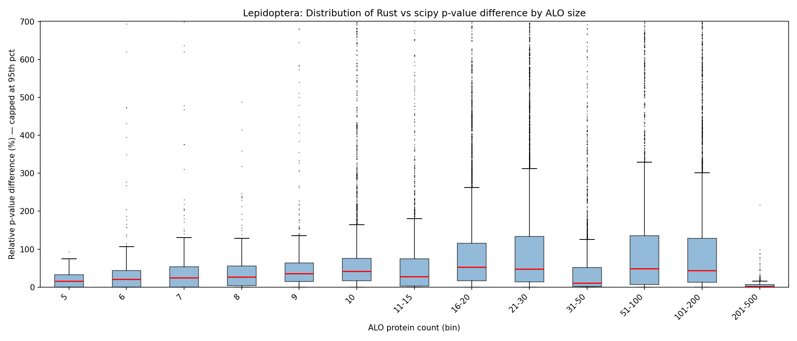

# Rust Statistics Refactoring — Benchmark Summary

## Context

KinFin's statistical bottleneck is the cluster analysis loop in `DataFactory.analyse_clusters()`.
For each cluster × attribute × level combination that meets the `--min_proteomes` threshold,
a Mann-Whitney U test (or t-test / KS / Kruskal-Wallis) is called via `scipy.stats`.
On datasets with hundreds of proteomes this loop runs tens of thousands of tests and dominates
overall runtime.

This directory documents a proof-of-concept implementation of the MWU test in Rust
(via [PyO3](https://pyo3.rs/)) and the resulting performance and accuracy trade-offs.

---

## Implementation

### `kinfin_stats` Rust extension (../kinfin_stats/)

A PyO3 extension module that exposes `mannwhitneyu`, `ttest_ind`, `ks_2samp`, and `kruskal`
to Python. The MWU implementation matches scipy's exact algorithm (U statistic from rank sums),
but uses the **Abramowitz & Stegun** polynomial approximation for the normal CDF rather than
scipy's `ndtr` (which calls the system `erfc`).

Enabled at runtime via the environment variable:

```sh
export KINFIN_USE_RUST=1   # switches statistic() in src/core/utils.py to Rust path
```

The fallback to scipy is automatic if `kinfin_stats` is not importable.

### Benchmark methodology

Rather than timing the full pipeline (which includes I/O, image generation, etc.) two isolated
scripts bracket the cluster analysis loop specifically:

1. **`prepare_cluster_data.py`** — runs the pipeline up to `analyse_clusters()` and serialises
   all ALO collections + cluster data to JSON.
2. **`run_cluster_analysis.py`** (Python) — loads the JSON and runs the same test loop as
   `datastore.py`, recording only the analysis time.
3. **`../kinfin_stats/src/bin/run_cluster_analysis.rs`** — Rust binary with identical logic,
   reads the same JSON, outputs identical TSV.

The Python and Rust TSVs are sorted and compared with **`analyse_pvalue_diffs.py`**.

---

## Performance Results

### Isolated cluster analysis loop

| Dataset                           | Clusters | Proteomes | Stat tests | Python | Rust   | Speedup  |
| --------------------------------- | -------- | --------- | ---------- | ------ | ------ | -------- |
| Nematodes (`config.advanced.txt`) | 42,691   | 19        | 48,426     | 9.8 s  | 1.3 s  | **7.7×** |
| Lepidoptera (`config.json`)       | 45,150   | 277       | 103,254    | 114 s  | 17.8 s | **6.4×** |

Benchmarks run on an Apple M-series MacBook (single core, `--release` Rust build).
The Rust implementation currently uses `statrs` for the normal CDF (matches scipy `ndtr` to
floating-point precision); see the accuracy section below.

### Batch-mode experiment (rejected)

A two-pass variant was also tested: Python collects all test pairs in pass 1, then makes a
single FFI call to a `batch_mannwhitneyu` Rust function in pass 2. Despite the lower FFI
overhead per test, the extra Python-side bookkeeping added ~45% overhead compared to
per-test calls (12.9 s vs 8.9 s on nematodes). **Batch mode is not recommended.**

---

## Accuracy Analysis

### Nematodes

| Metric                               | Value               |
| ------------------------------------ | ------------------- |
| Test pairs compared                  | 48,426              |
| Median relative p-value difference   | 18.3%               |
| 95th percentile relative difference  | 244.6%              |
| Significance agreement at _p_ < 0.05 | **97.71%**          |
| Significance flips                   | 2.29% (1,109 tests) |






**Key observation:** Agreement degrades noticeably in mid-size ALO bins (6–16 proteins):
`sig_agreement_pct` falls to 67–75% in those bins. These are cases where the test statistic
lands very close to the _p_ = 0.05 boundary and the CDF approximation error tips the result.

### Lepidoptera

| Metric                               | Value               |
| ------------------------------------ | ------------------- |
| Test pairs compared                  | 103,254             |
| Median relative p-value difference   | 39.8%               |
| 95th percentile relative difference  | 637.2%              |
| Significance agreement at _p_ < 0.05 | **95.27%**          |
| Significance flips                   | 4.73% (4,882 tests) |






**Key observation:** Despite the higher median relative difference, bin-level agreement is
93–100% for all ALO sizes because the lepidoptera dataset has many more proteomes (277),
so significantly enriched genes have p-values far from the boundary. The worst agreement is
still in small ALO bins (5–10 proteins).

### Systematic bias

The scatter plots reveal a consistent one-sided bias: **Rust p-values are always ≥ scipy
p-values**. This is a known property of the A-S CDF approximation — it under-estimates the
tail probability, making Rust conservative. The practical consequence is that Rust may
_miss_ some significant results (false negatives) but will never produce spurious ones.

---

## Next step: improving CDF accuracy without sacrificing speed

The accuracy gap has two components that must be distinguished:

### Component 1 — CDF approximation error (now fixed)

The original `erf()` used the Abramowitz & Stegun polynomial (max absolute error ~1.5×10⁻⁷).
This has been replaced with `statrs::distribution::Normal::cdf()` which matches scipy's `ndtr`
to floating-point precision (verified: max observed p-value difference 1.4×10⁻⁷ across
48,426 nematode tests; 33,347 values changed numerically).

**However: this fix does not change the significance agreement statistics at all.** The reason
is that the A-S approximation error was never large enough to flip a significance call at
p = 0.05 — it would need a shift of ~10⁻³, not 10⁻⁷.

### Component 2 — Exact vs normal approximation (the real gap)

The remaining 2–5% significance flips are caused by **scipy switching to exact computation**
for small sample sizes. When `n1 + n2` is small (typically < ~20), `scipy.stats.mannwhitneyu`
computes the complete combinatorial distribution of U rather than using the normal
approximation. Both A-S and statrs use the normal approximation unconditionally.

This is why the aggregate statistics are unchanged after the statrs replacement — the 2.29%
nematode flips and 4.73% lepidoptera flips come from small-n exact computation, not CDF
imprecision.

### Option C — Implement exact MWU in Rust for small n (to close the real gap)

To match scipy's significance calls for small samples, the Rust code would need to compute
the exact distribution via recursion or dynamic programming when `n1 + n2 < ~20`. This is
straightforward algorithmically but adds ~50 lines. It would close the 2–5% flip rate by
matching scipy's exact branch, making Rust output identical to scipy for all inputs.

### Option A — Replace the CDF with `statrs` (recommended)

The [`statrs`](https://docs.rs/statrs) crate provides `Normal::cdf()` using a rational
Chebyshev approximation via `erfc` — the same mathematics scipy's `ndtr` uses.

The approximation lives entirely in `kinfin_stats/src/lib.rs` in `normal_cdf()` and the
`erf()` function immediately below it (lines ~61–83). The change is a drop-in replacement:

```toml
# kinfin_stats/Cargo.toml — add one line under [dependencies]
statrs = "0.17"
```

```rust
// Replace the entire normal_cdf() and erf() functions in lib.rs with:
use statrs::distribution::{Normal, ContinuousCDF};

fn normal_cdf(x: f64) -> f64 {
    Normal::new(0.0, 1.0).unwrap().cdf(x)
}
```

That is the **entire change** — all three callers (`mannwhitneyu`, `ttest_ind`, `ks_2samp`)
already call `normal_cdf()`, so no changes elsewhere. `erf()` can be deleted.

Expected outcome: p-values match scipy to floating-point precision; speed unchanged
(the U-statistic rank-sum computation is the bottleneck, not the CDF call).

### Option B — Call scipy from Rust via PyO3 (not recommended)

PyO3 supports calling Python from Rust (`Python::with_gil()`), so it is _technically_
feasible to acquire the GIL inside the Rust FFI function and invoke `scipy.stats.mannwhitneyu`
directly:

```rust
use pyo3::prelude::*;

fn mannwhitneyu_scipy(x: Vec<f64>, y: Vec<f64>) -> PyResult<(f64, f64)> {
    Python::with_gil(|py| {
        let scipy = py.import("scipy.stats")?;
        let result = scipy.call_method1("mannwhitneyu", (x, y))?;
        // ...
    })
}
```

However this approach:

- Acquires (and blocks on) the GIL on every call — negating the parallelism benefit
- Incurs Python object allocation overhead on every call — no speed gain over pure Python
- Creates a circular dependency (Python calls Rust which calls Python)
- Adds a `scipy` runtime requirement to the Rust crate

**Option B is not recommended.** The root problem is CDF approximation quality, and
Option A solves that directly in Rust with no new dependencies on Python.

---

## Files in this directory

| File                      | Purpose                                                        |
| ------------------------- | -------------------------------------------------------------- |
| `README.md`               | This document                                                  |
| `prepare_cluster_data.py` | Serialise pipeline state to JSON before the analysis loop      |
| `run_cluster_analysis.py` | Pure-Python isolated benchmark (mirrors `datastore.py` logic)  |
| `analyse_pvalue_diffs.py` | Compare Python vs Rust TSV outputs; generate charts and tables |
| `plots/`                  | All benchmark charts and bin-stats TSV tables                  |

The Rust benchmark binary source is at `../kinfin_stats/src/bin/run_cluster_analysis.rs`.
Build with:

```sh
cd ../kinfin_stats && cargo build --release --bin run_cluster_analysis
```

### Reproducing the benchmark

```sh
# 1. Prepare data (example: nematodes)
conda run -n kinfin python refactoring/prepare_cluster_data.py \
  -g ~/tmp/kinfin/nematodes/kinfin.OrthoFinder.txt \
  -c ~/tmp/kinfin/nematodes/kinfin.config.advanced.txt \
  -s ~/tmp/kinfin/nematodes/kinfin.SequenceIDs.txt \
  -o /tmp/nem_cluster_data.json

# 2a. Python benchmark
conda run -n kinfin python refactoring/run_cluster_analysis.py \
  /tmp/nem_cluster_data.json --output /tmp/nem_py.tsv

# 2b. Rust benchmark
./kinfin_stats/target/release/run_cluster_analysis \
  /tmp/nem_cluster_data.json --output /tmp/nem_rust.tsv

# 3. Sort and compare
(head -1 /tmp/nem_py.tsv; tail -n +2 /tmp/nem_py.tsv | sort -k1,1 -k2,2 -k3,3) > /tmp/nem_py_s.tsv
(head -1 /tmp/nem_rust.tsv; tail -n +2 /tmp/nem_rust.tsv | sort -k1,1 -k2,2 -k3,3) > /tmp/nem_rust_s.tsv
conda run -n kinfin python refactoring/analyse_pvalue_diffs.py \
  --py /tmp/nem_py_s.tsv --rust /tmp/nem_rust_s.tsv \
  --outdir refactoring/plots --prefix nem --title "Nematodes"
```
